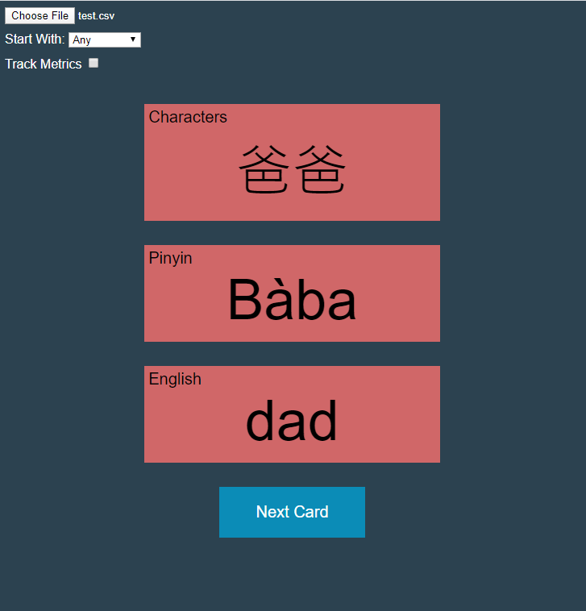

# Kanji Flashcards

## Website

You can access it here:
http://threesidedflashcards.s3-website-us-east-1.amazonaws.com/

## Why did I make this?

During college I studied abroad in Japan and enjoyed learning Japanese. Studying could be very frustrating, though. When learning a new word, there were three things you had to learn:

    1. The characters (Kanji)
    2. The hiragana/katakana (pronounciation / simpler writing form)
    3. The meaning (in English)

I also recently started studying Mandarin for fun. Again, three things I must learn for every word:

    1. The characters
    2. The pinyin (pronounciation)
    3. The meaning (in English)
    
With other subjects in school, I always used regular flashcards. But it's much harder to have three sides to a piece of paper. There are other three-sided flashcard apps out there but all the ones I found were either ugly, clunky, or had so many additional features that they got very complicated to use. Most also forced spaced-repetition features, which while a fantastic learning tool, make it harder to study specific vocab you want to review for a quiz the next day or so.

- I wanted something very minimalist in design. 
- I wanted something that allowed me to easily store vocab however I wanted.
- I wanted to easily change what side the app started with.
- I wanted the ability to turn off Spaced Repetition. 

I also didn't care about typing in my answers, just the ability to check if I was right. Most apps, if you don't want to have to bother typing in your answer, have to just deal with always answering "wrong" and overriding the app to say you were right. I like to study by writing my answers on a small portable whiteboard and comparing them. Or, if studying on the train, just picturing it in my head and checking the answer. Typing was an extra feature I didn't want, but every app had. 

## Screenshot

## Description

With this app, the user selects a CSV file with 3 columns. The first row being the name of the column.

Example:

| Characters        | Pinyin           | English  |
| ------------- |:-------------:| -----:|
| 你好      | nǐ hǎo | hello |
| 爸爸      | Bàba      |   dad |
| 妈妈 | Māma      |    mom |

The user then selects which column they'd like the app to start with or selects "Any."

The app will then reveal that side to the flashcard and the user can click to reveal the other two sides, one at a time.

Upon hitting "Next Card" this process will repeat.

## Development

This is plain Javascript, HTML, and CSS. It's hosted with AWS S3. Nothing fancy.

## Contributing

I don't want any changes to it, but feel free to clone and edit to your heart's desire.
